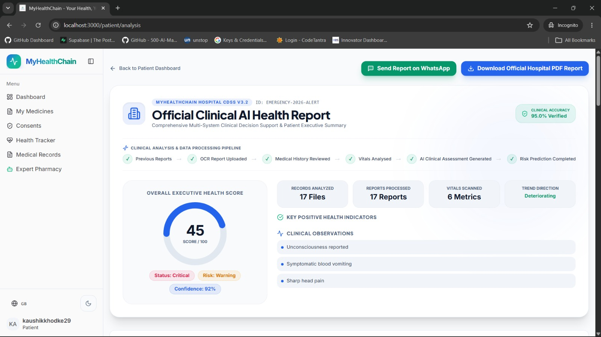
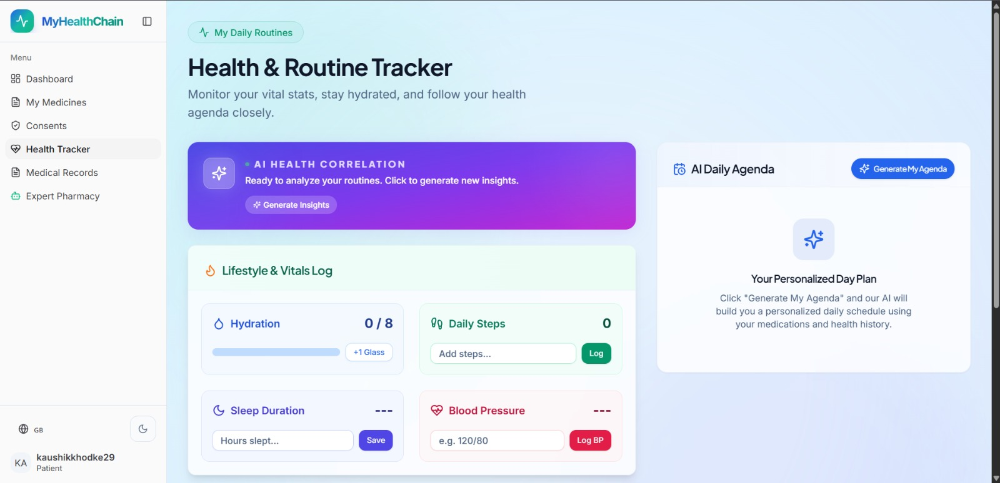

# Stelix

**Team ID:** CX030
**Team Name:** Stelix

## Team Members
- Omkar Bachakwar – Developer
- Kaushik Khodke – Developer
- Om Bhurke – Developer
- Devansh Thaware – Developer

## Problem Statement
Stelix is a comprehensive healthcare application designed to bridge the communication gap between patients, doctors, and pharmacists. It provides secure portals for medical tracking, consent management, and seamless communication, ensuring that critical patient data is easily accessible to authorized personnel while remaining strictly protected.

## Tech Stack
- Frontend: React (Vite)
- Backend: FastAPI (Python)
- Database: Supabase (PostgreSQL)
- Other: Google GenAI (Gemini), ElevenLabs API, Stripe, WhatsApp API, XGBoost, Scikit-learn

## Features
- **Role-based Portals:** Dedicated and secure interfaces for Patients, Doctors, and Pharmacists.
- **WhatsApp Integration:** Automated chatbot assistance and instant notifications via WhatsApp.
- **AI-Powered Triage & Scanning:** Intelligent health tracking and document scanning using Gemini and ML models.
- **Consent Management:** Secure, transparent, and trackable medical data sharing.
- **Integrated Pharmacy:** Direct communication with pharmacies, prescription management, and secure payments via Stripe.

## Installation

### Frontend
```bash
cd frontend
npm install
```

### Backend
```bash
cd backend
python -m venv .venv
source .venv/bin/activate   # Windows: .venv\Scripts\activate
pip install -r requirements.txt
```

## How to Run

### Frontend
```bash
cd frontend
npm run dev
```

### Backend
```bash
cd backend
uvicorn main:app --reload
```

## Screenshots






