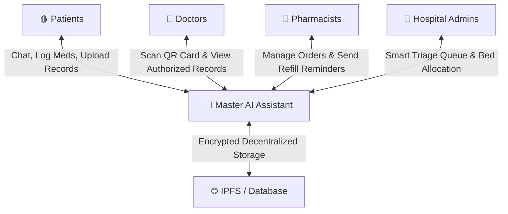

# 🏥 MyHealthChain (K Health Care)

### **Secure, AI-Powered Healthcare Orchestration & Records Platform**

MyHealthChain is an intelligent, patient-centric healthcare platform designed to simplify medical record management, streamline clinical workflows, and automate emergency responses. By combining secure, decentralized data storage with advanced Artificial Intelligence (AI) and Machine Learning (ML), the platform connects patients, doctors, pharmacists, and hospitals into a single, cohesive healthcare ecosystem.

---

## 🧭 How It Works (System Overview)

At its core, MyHealthChain acts as a secure digital bridge between healthcare providers and patients:



1.  **Patients** own their medical records. When they upload a prescription or report, it is encrypted and saved to a decentralized network so no single entity controls their personal data.
2.  **Doctors** can only see records if a patient explicitly grants them access. Doctors verify the patient's identity instantly by scanning a QR code on a physical card and typing in a secure PIN.
3.  **Pharmacists** use the platform to fulfill orders, check drug stocks, and receive automated voice/WhatsApp notifications when patients are running low on medications.
4.  **Hospitals** utilize the queue system to prioritize emergency incoming patients based on vital signs and direct staff and resource placement where they are needed most.

---

## 👥 Core Features by Persona

The platform is customized for four distinct roles:

### 1. Patients 🩸
*   **Decentralized Health Records**: Keep files safe on IPFS, a secure, tamper-proof network where data belongs to you.
*   **Consent Control**: Approve or deny doctor access to your reports. Set auto-expiry times so doctors lose access once your consultation is complete.
*   **AI Health Chatbot**: Ask questions about your symptoms or medical history in multiple languages (English, Hindi, Marathi). Listen to vocalized audio answers.
*   **Smart Medicine Cabinet**: Track daily doses, set reminders, view order logs, and purchase medications directly.

### 2. Doctors 🥼
*   **Quick QR Check**: Scan a patient's physical card to access their profile and medical history.
*   **Secure Access**: View authorized files and records. Every access is logged in an audit trail for compliance and safety.
*   **Direct Upload**: Add prescriptions directly to the patient's record profile during visits.

### 3. Pharmacists 💊
*   **Inventory Monitor**: Keep tabs on medicine stock levels and get alerts when stock is running low.
*   **Automated Outbound Alerts**: Trigger telephone voice calls or WhatsApp messages to remind patients of pending prescription refills.
*   **Voice Ordering Integration**: Receive orders generated automatically from conversational voice calls.
*   **Stripe Integration**: Process payments securely and fulfill orders automatically when a patient completes a transaction.

### 4. Hospital Emergency Teams 🏥
*   **Smart Triage Queue**: Incoming patients are automatically prioritized into emergency categories based on symptoms and vitals.
*   **Resource Balancer**: Track open ICU beds, ward beds, medical ventilators, and active doctor/nurse shifts in real time to prevent hospital capacity overload.

---

## 🧠 Conceptual AI & Machine Learning Layers

Rather than relying on human triage and manual analysis alone, MyHealthChain deploys intelligent backend agents to analyze health data:

### A. Health Risk Assessment Model (Theoretical Concept)
When a patient uploads medical records, our background AI scans the text to extract vital signs such as Blood Pressure, Sugar Levels, and Heart Rate. 
*   **How it decides**: An underlying **Random Forest Classifier** model analyzes these values.
*   **The Result**: It classifies the patient’s overall health risk status as **Healthy**, **Warning**, or **Critical**, warning them of abnormal blood sugar levels or high blood pressure trends.

### B. Emergency Triage Predictor (Theoretical Concept)
In high-stress emergency rooms, patient vitals are fed into the system's triage list.
*   **How it decides**: An **XGBoost Classifier** model matches heart rates, temperature, and blood oxygen levels to medical severity rules.
*   **The Result**: It sorts patients into five Emergency Severity levels ranging from **RED** (Immediate life-saving care needed) to **BLUE** (Non-urgent, routine checks). This list updates in real time on the hospital dashboard.

### C. Conversational Voice Agent (Telephony)
Patients who prefer not to use a screen can call a phone line to speak to an AI agent. The voice assistant checks the database, finds their prescriptions, orders the required medicines, and texts or emails them a direct **Stripe checkout link** to complete the payment.

### D. WhatsApp Doctor Assistant
Doctors can chat with the AI assistant through WhatsApp. The assistant verifies the doctor's phone number, answers clinical questions, and sends automated pharmacy refill updates to patients.

---

## 🚀 Easy Installation & Setup Guide

### 1. Set Up Environment Keys
Configure credentials for the services in your `.env` configuration files:
*   **Supabase Database**: Connection details (`VITE_SUPABASE_URL`, keys).
*   **Gemini AI**: API key to power conversational engines and vitals extraction.
*   **ElevenLabs & Twilio**: API keys to enable the telephone voice assistant and outbound calls.
*   **Stripe**: API credentials to test payment checkout.
*   **Pinata IPFS**: Keys to upload and encrypt documents.

---

### 2. Database Initialization
1.  Open your **Supabase Workspace** -> Go to the **SQL Editor**.
2.  Import and execute the following SQL schema migrations in order to create the tables, security policies, and real-time triggers:
    *   [overall.sql](file:///d:/hackathon/health%20care%20system/overall.sql) (Core Profiles, Patients, Doctors, Medicines)
    *   [supabase_migrations.sql](file:///d:/hackathon/health%20care%20system/supabase_migrations.sql) (Reminders, Routines, Logs)
    *   [supabase_triage.sql](file:///d:/hackathon/health%20care%20system/supabase_triage.sql) (Triage queue tables)
    *   [supabase_resource_balancer.sql](file:///d:/hackathon/health%20care%20system/supabase_resource_balancer.sql) (Beds, Staff load balancer tables)

---

### 3. Quick Startup (Unified Windows Run)
To start the React frontend, Python FastAPI backend, and public secure callback tunnel all at once, open PowerShell as an Administrator and execute:
```powershell
.\start_all.ps1
```
*This script launches the servers, sets up a secure tunnel for ElevenLabs voice connections, and opens a text file listing your active endpoints.*

To manually stop the services later, run the stop command outputted by the script.

---

## 🏃 Detailed Running Guide (Individual Services)

If you prefer to start each service manually in its own terminal window rather than using the unified script, follow these steps:

### 1. Backend Server (FastAPI)
1. Navigate to the backend directory:
   ```bash
   cd backend
   ```
2. Install the Python packages:
   ```bash
   pip install -r requirements.txt
   ```
3. Launch the development server:
   ```bash
   uvicorn main:app --host 0.0.0.0 --port 8000 --reload
   ```

### 2. Frontend Development Server (React)
1. Navigate to the frontend directory:
   ```bash
   cd frontend
   ```
2. Install the node packages:
   ```bash
   npm install
   ```
3. Run the hot-reloading development server:
   ```bash
   npm run dev -- --port 3000
   ```

### 3. WhatsApp Gateway Integration
You can start the WhatsApp Gateway in any of the following ways:

#### Option A: Running from Project Root (Recommended)
Simply run `node index.js` directly from the root directory:
```bash
node index.js
```
*(Or run `npm start` / `npm run whatsapp`)*

#### Option B: Full Startup Script (Backend + Frontend + WhatsApp GW + Tunnel)
```powershell
.\start_all.ps1
```

#### Option C: Running directly inside `whatsapp-gateway` directory
```bash
cd whatsapp-gateway
npm install
node index.js
```
4. Scan the rendered QR Code with your phone's WhatsApp application.

### 4. Setting up Ngrok Tunneling
If you are using **Ngrok** instead of Serveo to expose the backend port 8000 for voice/telephony webhooks:
1. Start an HTTP tunnel pointing to the backend port:
   ```bash
   ngrok http 8000
   ```
2. In a separate terminal, fetch your active public HTTPS tunnel URL:
   ```bash
   python get_ngrok_url.py
   ```
3. Save the resulting HTTPS URL in the `VITE_API_URL` of your frontend `.env` and configure your ElevenLabs/Twilio webhooks with this link.

---

## 🧪 Seeding & Test Tools
*   **Ingest Demo Data**: Run [demo.py](file:///d:/hackathon/health%20care%20system/demo.py) to seed 35 sample patients, create matching login credentials, and upload sample prescription history documents.
*   **Populate Hospital Assets**: Run [seed_resources.py](file:///d:/hackathon/health%20care%20system/seed_resources.py) to automatically pre-fill ICU/ward beds and list hospital staff shifts.
*   **Validate Setup**: Check database rows using `python backend/check_db_counts.py` or test voice agents with `python backend/test_11labs.py`.


